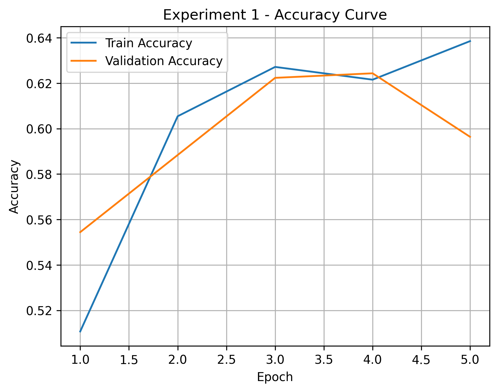
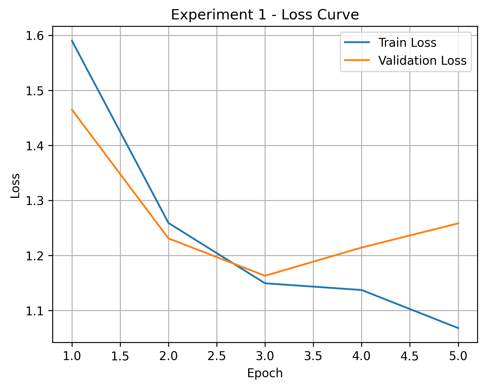
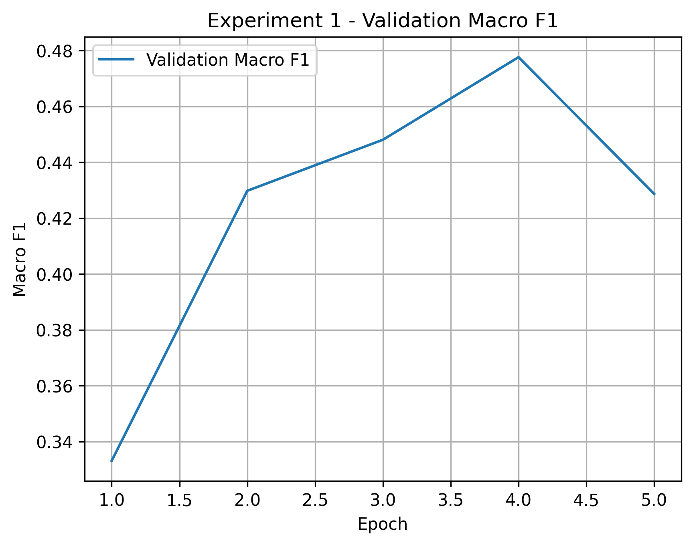
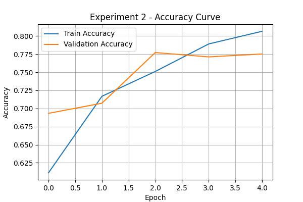
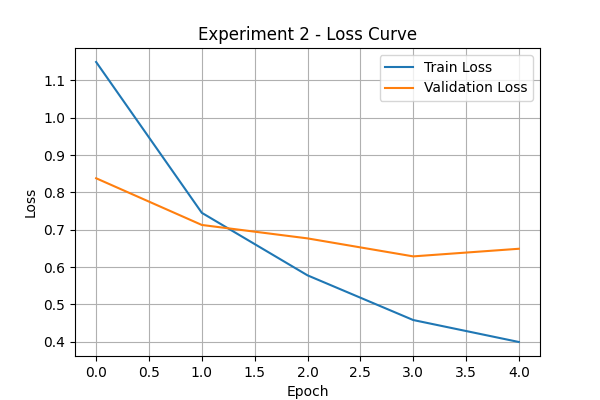
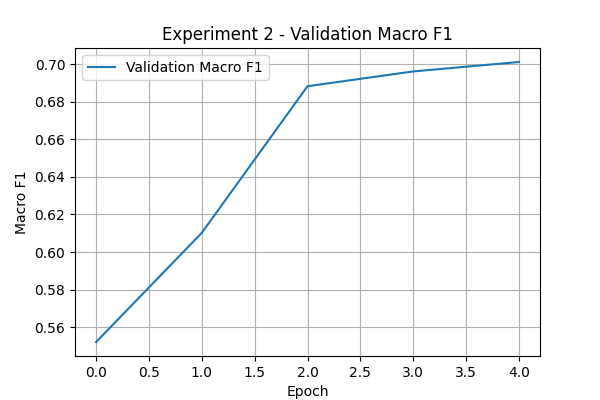
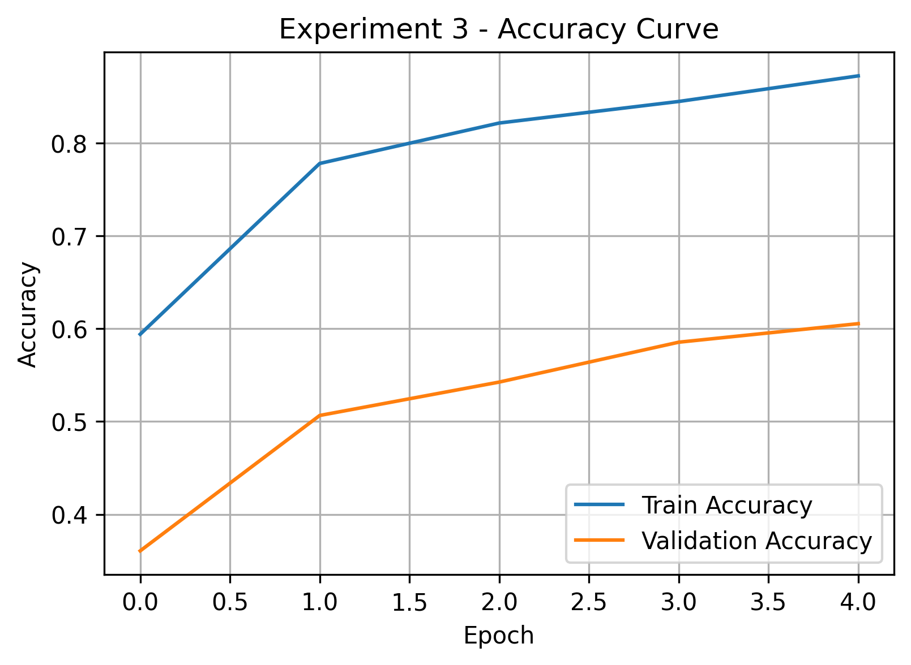
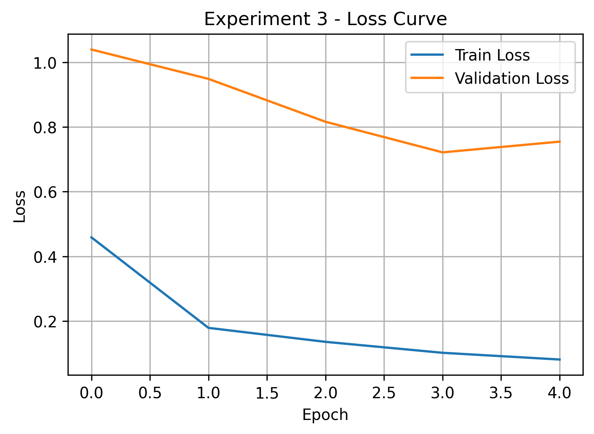
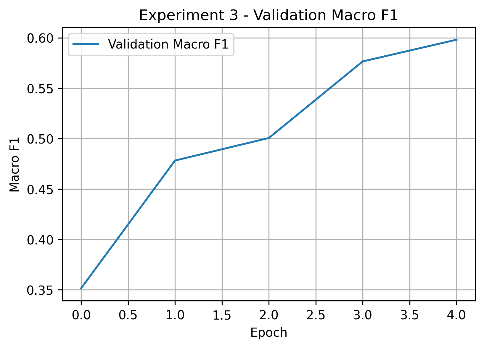

# skin-cancer-xai-ham10000
Skin lesion classification using deep learning (HAM10000) with transfer learning and Grad-CAM explainability for medical image classification.

# Skin Cancer Classification with Explainable AI

This project builds a deep learning model to classify dermoscopic skin lesion images from the HAM10000 dataset using transfer learning and Grad-CAM explainability.

---

## Dataset

Dataset: HAM10000 (Human Against Machine with 10000 training images)

Classes:
- akiec
- bcc
- bkl
- df
- mel
- nv
- vasc

---

## Model Experiments

We evaluated several models including baselines and transfer learning architectures.

| Model | Accuracy | Macro F1 |
|------|------|------|
Random Baseline | 0.15 | 0.086 |
Majority Baseline | 0.67 | 0.11 |
Logistic Regression | 0.43 | 0.20 |
Final Model (ResNet18 Fine-Tuned) | **0.78** | **0.65** |

---

## Training Curves

### Experiment 1

Accuracy

Loss

Macro F1

---

### Experiment 2 (Best Model)

Accuracy

Loss

Macro F1

---

### Experiment 3

Accuracy

Loss

Macro F1

---

## Explainability (Grad-CAM)

Grad-CAM visualizations were used to interpret the predictions made by the CNN model.

These heatmaps highlight which regions of the skin lesion images were most influential in the model’s predictions.

---

---

## Key Insights

- Transfer learning significantly improved performance compared to baseline models.
- Class imbalance in the dataset affects model performance for minority classes.
- Grad-CAM visualizations show that the model focuses primarily on lesion regions when making predictions.

---

## Technologies Used

- Python
- PyTorch
- Scikit-learn
- Matplotlib
- Grad-CAM

